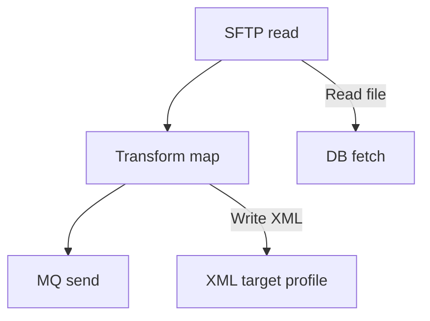

# Boomi Automation Detailed Guide

## Purpose

This guide explains how to automate Boomi integration pattern creation using:
- a YAML manifest as AML
- a Python automation script (`boomi.py`)
- reusable component definitions
- CSV component inventory for auditing and reuse

The sample flow covers an SFTP read, DB source profile, XML target profile, map transformation, and MQ send.

---

## Table of Contents

1. Architecture overview
2. Manifest structure
3. `boomi.py` design and API
4. CSV configuration for reusable components
5. Step-by-step automation workflow
6. Actual automation results
7. Example use case
8. Reuse patterns and best practices
9. Sample component inventory
10. Quick start
11. Environment variables
12. Troubleshooting

---

## 1. Architecture overview

The automation pipeline is:


### Components

- `boomi.py`: generator script
- `manifest.yaml`: AML definition of the process
- `boomi_component_ids.csv`: stored component IDs
- Boomi API: REST endpoint for component creation

---

## 2. Manifest structure

The manifest defines all components required to build the process.

| Section | Purpose |
|---|---|
| `pattern` | Main orchestration process metadata |
| `sftp` | SFTP connector and operation configuration |
| `source_profile` | Database source profile and SQL query |
| `target_profile` | Target XML profile definition |
| `map` | Field mappings between source and target |
| `mq` | MQ connector and operation configuration |
| `process_properties` | Reusable runtime metadata values |
| `subprocesses` | Names for SFTP and MQ subprocesses |
| `map_function` | Name of reusable function used in the map |

### Manifest example

```yaml
pattern:
  name: "SFTPTRANSJMS"
  description: "SFTP{Get}- Transformation - MQ{Send}"
  folder_id: ""

sftp:
  reuse: false
  existing_connector_id: ""
  connector_name: "AxwaySFTP"
  host: "172.16.16.12demo"
  port: 8022
  username: "INT-RIH-BOOMI-GL-test"
  auth_type: "Key_File_Path"
  key_path: "/mount/.../ssh_key/axway"
  remote_directory: ""
  read_file_name: "sample.txt"
  operation_name: "sftp read operation"
  action_after_read: "none"

source_profile:
  name: "[sftp]CUSTOMERMASTER DB"
  table_name: "win_gcif_all_info_table"
  sql: |
    SELECT address_5, booking_office, ccif_no, control_office,
    core_info_control_office, crnt_profit_center1, crnt_profit_center2,
    crnt_profit_center3, cust_full_name, cust_type, gcif_no,
    mizuho_ccif_no, resident_type, swift_branch_code, lc_idf_gur_type,
    local_language, profit_owner_mizuho_ccif_no,
    gen_random_uuid() FROM win_gcif_all_info_table

target_profile:
  name: "[CGI] CustomerMaster XML"
  root_element: "Proponix"

map:
  name: "Map_Template"

mq:
  reuse: false
  existing_connector_id: ""
  connector_name: "CON_HUB_INT-test"
  server_type: "WEBSPHERE_MQ_MULTI_INSTANCE"
  host_list: "172.16.16.22(1414)"
  queue_manager: "RIHQMINTSITHUB01-test"
  channel: "BOOMI.SVRCONN.SIT1"
  use_ssl: true
  ssl_cipher: "TLS_ECDHE_RSA_WITH_AES_256_GCM_SHA384"
  operation_name: "OP_CGI_CUSTOMER_SEND"
  destination_queue: "queue://QL.RIHINT.OUT.TRADE.CGI.CMN1-test"
  destination_type: "text_message"

process_properties:
  name: "PP_CustomerMaster"
  values:
    DestinationID: "PRO"
    SenderID: "MIZ"
    OperationOrganizationID: "BBPLCUK"
    MessageType: "CUSTMER"
    RebateIndicator: "Y"
    InitialChange: "A"
    CustomerEntryType: "BNK"
    Severity: "HIGH"
    Payload: "Payload"
    EnvironmentName: "1_POC"
    Source_System: "CustomerMAsterDB"
    Target_System: "CGI"

subprocesses:
  sftp_subprocess_name: "[SUB]GET-AxwaySFTP"
  mq_subprocess_name: "[SUB]Send_MQ"

map_function:
  name: "CurDate_to_YYYYMMDD"
```

---

## 3. `boomi.py` design and API

The `boomi.py` script provides a reusable Boomi automation API:

- `BoomiClient` to call Boomi REST API
- `create_component(xml_body)` to create any component
- `create_or_reuse(label, xml_body, existing_id)` to reuse existing connector IDs
- `save_ids_csv(ids, path)` to export inventory
- component builder functions for process property, map, profiles, connector configuration, and processes

### Key methods

| Method | Purpose |
|---|---|
| `load_manifest(path)` | Load YAML manifest from disk |
| `load_existing_ids(csv_path)` | Load existing component IDs from CSV for reuse |
| `BoomiClient.create_component(xml_body)` | Create a Boomi component via REST |
| `BoomiClient.create_or_reuse(label, xml_body, existing_id)` | Reuse component ID if available, else create new one |
| `BoomiClient.save_ids_csv(ids, path)` | Persist the component inventory as CSV |
| `run(manifest_path, csv_path, existing_ids_path, dry_run)` | Main orchestration flow with optional reuse |

### Example usage

**Dry-run (validate manifest without creation):**
```bash
python boomi.py "boomi manifest file.txt" --csv boomi_component_ids.csv --dry-run
```

**Live creation (create new components):**
```bash
python boomi.py "boomi manifest file.txt" --csv boomi_component_ids.csv
```

**Reuse existing components (load from previous CSV):**
```bash
python boomi.py "boomi manifest file.txt" --csv boomi_component_ids_new.csv --load-ids boomi_component_ids.csv
```

### CLI options

| Option | Required | Description |
|---|---|---|
| `manifest_path` | Yes | Path to YAML manifest file |
| `--csv output_path` | Yes | Output CSV file for component inventory |
| `--load-ids existing_path` | No | Load existing component IDs from CSV to reuse (prevents duplicate creation) |
| `--dry-run` | No | Validate manifest without creating components |

---

## 4. CSV configuration for reusable components

The automation stores components in CSV so that future deployments can reuse stable IDs.

### CSV column definitions

| Column | Description |
|---|---|
| `ComponentType` | Boomi component type (process, connector-settings, profile.db, etc.) |
| `ComponentName` | Name used in the manifest and Boomi |
| `ComponentID` | Boomi internal ID returned by the API |
| `Reuse` | `true` if the component is reused instead of created |
| `Notes` | Additional context for the component |

### Sample CSV inventory

```csv
ComponentType,ComponentName,ComponentID,Reuse,Notes
processproperty,PP_CustomerMaster,1234-5678,false,Process property pack for header values
transform.function,CurDate_to_YYYYMMDD,2345-6789,false,Reusable date function
profile.xml,[CGI] CustomerMaster XML,3456-7890,false,Target XML profile
profile.db,[sftp]CUSTOMERMASTER DB,4567-8901,false,Source database profile
transform.map,Map_Template,5678-9012,false,Field mapping definition
connector-settings,CON_HUB_INT-test,6789-0123,false,WebSphere MQ connector
connector-action,OP_CGI_CUSTOMER_SEND,7890-1234,false,MQ send operation
connector-settings,AxwaySFTP,8901-2345,false,SFTP connector
connector-action,sftp read operation,9012-3456,false,SFTP read operation
process,[SUB]GET-AxwaySFTP,0123-4567,false,SFTP subprocess
process,[SUB]Send_MQ,1234-5678,false,MQ subprocess
process,SFTPTRANSJMS,2345-6789,false,Main orchestration process
```

---

## 5. Step-by-step automation workflow

### First-time deployment (new components)

1. Create or update the YAML manifest.
2. Run `boomi.py` in dry-run mode to validate the manifest:
   ```bash
   python boomi.py "boomi manifest file.txt" --csv boomi_component_ids.csv --dry-run
   ```
3. Inspect the generated component inventory CSV.
4. Update manifest values for environment-specific settings.
5. Run `boomi.py` live to create components:
   ```bash
   python boomi.py "boomi manifest file.txt" --csv boomi_component_ids.csv
   ```
6. Store the component ID CSV in source control or a secure repository.

### Redeployment (reuse existing components)

1. Update the manifest for the new environment/version.
2. Run with `--load-ids` to reuse existing component IDs:
   ```bash
   python boomi.py "boomi manifest file.txt" --csv boomi_component_ids_new.csv --load-ids boomi_component_ids.csv --dry-run
   ```
3. Verify the output shows `[REUSE]` for components loaded from the existing CSV.
4. Run live:
   ```bash
   python boomi.py "boomi manifest file.txt" --csv boomi_component_ids_new.csv --load-ids boomi_component_ids.csv
   ```
5. Review the new CSV inventory to confirm reuse flags and any newly created components.

---

## 6. Actual automation results

### Current execution outcome

The automation was executed with:

```bash
python boomi.py "boomi manifest file.txt" --csv boomi_component_ids.csv
```

This run produced a partial success:
- 9 components created successfully in Boomi
- The SFTP subprocess failed during creation due to Boomi XML validation
- The main orchestration process was not created because the subprocess dependency failed

### Components created successfully

| Component Name | Type | Component ID |
|---|---|---|
| PP_CustomerMaster | processproperty | 778d3bce-e5a5-4ada-8991-1cf1a66ce757 |
| CurDate_to_YYYYMMDD | transform.function | 618d7fb7-79a1-4c62-b9b9-ecd80f6873a6 |
| [CGI] CustomerMaster XML | profile.xml | 3d5dbd78-8ccd-4dc4-ac1a-e548276e132f |
| [sftp]CUSTOMERMASTER DB | profile.db | 8239d473-bd5d-4a2d-ab81-8b090ced72e7 |
| Map_Template | transform.map | c1b26b1d-0608-44f2-826c-d32f3d45b1f1 |
| CON_HUB_INT-test | connector-settings | 4a47c382-bb87-43f0-a688-005d2de179b8 |
| OP_CGI_CUSTOMER_SEND | connector-action | 05b6cc4c-f20d-48a7-bd2a-f1be75d91229 |
| AxwaySFTP | connector-settings | 13c9c9fc-4d48-416c-b908-9d40cfcb92cd |
| sftp read operation | connector-action | 2df9436d-f544-4bc1-9653-ff420b5c872e |

### Components not created

| Component Name | Type | Error |
|---|---|---|
| [SUB]GET-AxwaySFTP | process (subprocess) | HTTP 400: Unable to read message body. Please make sure the structure is correct. |
| [SUB]Send_MQ | process (subprocess) | Not created (depends on SFTP subprocess) |
| SFTPTRANSJMS | process | Not created (depends on subprocesses) |

### Recommended next step

The failure is caused by the subprocess XML structure. Validate the subprocess component XML against Boomi's REST API schema and then rerun the automation. Common fixes include ensuring correct element nesting, valid `connectoraction` configuration, and proper `parameter-profile` usage.

---

## 7. Example use case

### Business requirement
A customer master feed from SFTP must be transformed and sent to MQ daily.

### Implementation
- Use the `sftp` section to define SFTP host credentials and read action.
- Use the `source_profile` SQL to extract source fields.
- Use the `target_profile` XML schema for Boomi mapping.
- Use `map_function` for file-date formatting.
- Use `mq` section to configure the WebSphere MQ output.
- Use `process_properties` for all header metadata that can change by environment.

### Process flow diagram



---

## 8. Reuse patterns and best practices

### Component reuse strategies

- **CSV-based reuse:** Store connector IDs in CSV after initial creation, then load with `--load-ids` in subsequent runs.
- **Manifest-based reuse:** Set `reuse: true` and `existing_connector_id` in the manifest for connectors you know already exist.
- **Mixed approach:** Use `--load-ids` for automatic lookup, and override with manifest entries when needed.

### Best practices

- Store component ID CSV in source control or a secure repository for audit trail.
- Keep connector names constant across manifests to enable CSV reuse matching.
- Separate static component definitions from environment-specific values.
- Maintain one manifest per integration pattern.
- Use `boomi.py` as a reusable library in other automation repos.
- Run with `--dry-run` before live creation to validate all references.
- Document the component inventory CSV location and versioning strategy.

### Reusable component table

| Component | Reuse scenario | Manifest section | Reuse method |
|---|---|---|---|
| SFTP connector | reuse across multiple processes | `sftp` | `--load-ids` or manifest `existing_connector_id` |
| MQ connector | reuse when same queue manager/channel applies | `mq` | `--load-ids` or manifest `existing_connector_id` |
| Process property pack | reuse for consistent business values | `process_properties` | `--load-ids` |
| Source profile | reuse when same DB schema is used | `source_profile` | `--load-ids` |
| Target profile | reuse across similar XML formats | `target_profile` | `--load-ids` |

---

## 9. Sample component inventory

| Process Name | Component Type | Component ID | Reuse | Notes |
|---|---|---|---|---|
| `SFTPTRANSJMS` | process | 2345-6789 | false | Main orchestration process |
| `[SUB]GET-AxwaySFTP` | process | 0123-4567 | false | SFTP subprocess |
| `[SUB]Send_MQ` | process | 1234-5678 | false | MQ subprocess |
| `CON_HUB_INT-test` | connector-settings | 6789-0123 | false | MQ connector |
| `OP_CGI_CUSTOMER_SEND` | connector-action | 7890-1234 | false | MQ operation |
| `AxwaySFTP` | connector-settings | 8901-2345 | false | SFTP connector |
| `sftp read operation` | connector-action | 9012-3456 | false | SFTP operation |
| `PP_CustomerMaster` | processproperty | 1234-5678 | false | Process property pack |
| `Map_Template` | transform.map | 5678-9012 | false | Data mapping |
| `CurDate_to_YYYYMMDD` | transform.function | 2345-6789 | false | Date function |

---

## 9. Notes on diagrams and pictures

The document includes flowcharts in Mermaid format. If you need PNG or SVG diagrams, use a Mermaid renderer or VS Code Markdown preview with Mermaid support.

If actual images are required, export the Mermaid diagrams to image files and attach them to the guide.

---

## 10. Quick start

### First run

1. Install dependencies:
   ```bash
   pip install pyyaml
   ```
2. Run dry-run to validate:
   ```bash
   python boomi.py "boomi manifest file.txt" --csv boomi_component_ids.csv --dry-run
   ```
3. Confirm the CSV contains the expected components.
4. Run live creation:
   ```bash
   python boomi.py "boomi manifest file.txt" --csv boomi_component_ids.csv
   ```

### Subsequent runs (reuse)

1. Update manifest for new environment or version.
2. Load existing component IDs to reuse:
   ```bash
   python boomi.py "boomi manifest file.txt" --csv boomi_component_ids_v2.csv --load-ids boomi_component_ids.csv --dry-run
   ```
3. Verify output shows `[REUSE]` tags for existing components.
4. Run live:
   ```bash
   python boomi.py "boomi manifest file.txt" --csv boomi_component_ids_v2.csv --load-ids boomi_component_ids.csv
   ```

## 11. Environment variables

The `BoomiClient` can use environment variables to override default credentials:

```bash
export BOOMI_ACCOUNT_ID="your-account-id"
export BOOMI_USERNAME="your-email@domain.com"
export BOOMI_TOKEN="your-boomi-token"
export BOOMI_BASE_URL="https://api.boomi.com/api/rest/v1/..."
```

If not set, the script uses defaults embedded in the code.

## 12. Troubleshooting

| Issue | Solution |
|---|---|
| `PyYAML is required` | Run `pip install pyyaml` |
| Components created with wrong IDs | Use `--dry-run` first; verify manifest structure |
| CSV not created | Check `--csv` output path has write permissions |
| Reuse not working | Verify component names match exactly between old and new CSV |
| API authentication failed | Check BOOMI credentials in environment or code defaults |
