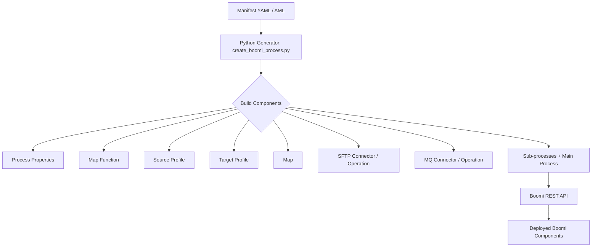
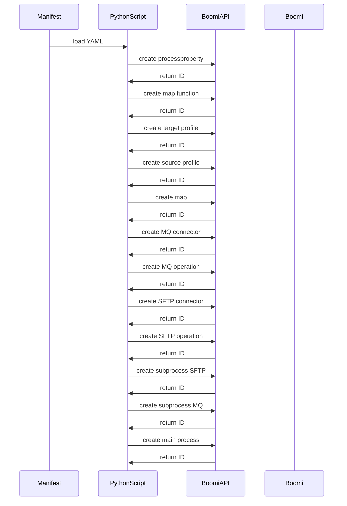

# Boomi Automation Process Documentation

## 1. Overview

This document describes how to automate Boomi process creation using a manifest-driven approach and a Python generator. The manifest acts as an Automation Markup Language (AML) definition for a reusable Boomi pattern.

The sample manifest defines an end-to-end pattern:
- SFTP source read
- Database source profile
- XML target profile
- Data mapping
- MQ destination send
- Process properties for dynamic values

The Python generator (`create_boomi_process.py`) reads the manifest and creates Boomi components via the Boomi REST API.

---

## 2. Key Concepts

| Term | Description |
|---|---|
| AML / Manifest | YAML-based automation definition describing connectors, profiles, maps, and process components |
| Reusable component | Boomi component like connector or connector operation that can be created once and reused in multiple processes |
| Component ID | Boomi internal ID returned by the API when a component is created |
| CSV storage | Simple portable format to record component names and IDs for reuse and audit |
| Python generator | Script that translates the manifest into Boomi XML and API calls |

---

## 3. Manifest-driven Automation Architecture



---

## 4. Step-by-step Guidance for Each Component

### 4.1 Process Properties

Purpose: store reusable runtime values for process execution.

Steps:
1. Define `process_properties` in the manifest.
2. List each property in `values`.
3. The script creates a `processproperty` component.
4. The map uses the process property IDs to inject values into XML.

Example manifest section:
```yaml
process_properties:
  name: "PP_CustomerMaster"
  values:
    DestinationID: "PRO"
    SenderID: "MIZ"
    OperationOrganizationID: "BBPLCUK"
    MessageType: "CUSTMER"
```

### 4.2 Map Function

Purpose: define reusable transform logic.

Steps:
1. Define `map_function.name` in the manifest.
2. The generator creates a `transform.function` component.
3. The main map references this function for date transformation or other logic.

### 4.3 Source Profile

Purpose: describe the input data structure from DB or file.

Steps:
1. Define `source_profile.name` and SQL statement.
2. The Python code builds a `profile.db` component.
3. The source profile fields are used in the map.

### 4.4 Target Profile

Purpose: describe the XML output structure.

Steps:
1. Define `target_profile.name` and `root_element`.
2. The generator creates a `profile.xml` component.
3. This profile structures the target XML tree.

### 4.5 Map

Purpose: connect source fields, process properties, and functions to the target XML.

Steps:
1. Define `map.name` in the manifest.
2. The generator builds a `transform.map` component.
3. Map source field IDs to target elements and function outputs.
4. Use process property component IDs inside the map function configuration.

### 4.6 Connectors and Operations

#### SFTP Connector / Operation

Purpose: read a file from SFTP.

Steps:
1. Define `sftp.connector_name`, host, port, username, auth type, key path.
2. The script creates a `connector-settings` for the SFTP connector.
3. Create an SFTP `connector-action` operation for READ.
4. Build the subprocess that performs the SFTP read.

#### MQ Connector / Operation

Purpose: send transformed data to WebSphere MQ.

Steps:
1. Define `mq.connector_name`, `host_list`, `queue_manager`, `channel`, `ssl_cipher`.
2. Create a `connector-settings` component for MQ.
3. Create an MQ `connector-action` operation for SEND.
4. Build the subprocess that sends documents to the MQ queue.

### 4.7 Process Orchestration

Purpose: sequence the SFTP read, transform, and MQ send.

Steps:
1. Create a sub-process for SFTP read.
2. Create a sub-process for MQ send.
3. Create the main process that calls the SFTP subprocess, then map, then MQ subprocess.
4. Use process call shapes and return paths.

---

## 5. Component Creation Sequence



---

## 6. Reusable Component Strategy

Reusable components reduce duplication and speed deployment.

### Reusable component categories

- Connector settings
- Connector operations
- Process property packs
- Source/target profiles
- Map functions
- Sub-process templates

### Reuse rules in manifest

| Field | Purpose |
|---|---|
| `reuse: true` | Indicates existing component reuse instead of creating a new connector |
| `existing_connector_id` | Existing Boomi component ID to reuse for connector settings |

Example reuse manifest entry:
```yaml
mq:
  reuse: true
  existing_connector_id: "existing-mq-uuid"
  connector_name: "CON_HUB_INT-test"
```

### How to store component IDs

Store component IDs in a CSV table for auditing and reuse.

| ComponentType | ComponentName | ComponentID | Reuse | Notes |
|---|---|---|---|---|
| processproperty | PP_CustomerMaster | 1234-5678 | false | property pack for header values |
| connector-settings | CON_HUB_INT-test | 2345-6789 | false | MQ connector |
| connector-action | OP_CGI_CUSTOMER_SEND | 3456-7890 | false | MQ SEND operation |
| connector-settings | AxwaySFTP | 4567-8901 | false | SFTP connector |
| connector-action | sftp read operation | 5678-9012 | false | SFTP READ operation |

A sample CSV file is included as `component_ids_sample.csv`.

---

## 7. Example MQ Connector XML

This is the XML structure generated by `build_mq_connector()`.

```xml
<Component xmlns:bns="http://api.platform.boomi.com/" xmlns:xsi="http://www.w3.org/2001/XMLSchema-instance" name="CON_HUB_INT-test" type="connector-settings" subType="officialboomi-X3979C-jmsv2-prod" folderId="">
  <bns:encryptedValues/>
  <bns:description/>
  <bns:object>
    <GenericConnectionConfig>
      <field id="version" type="string" value="V2_0"/>
      <field id="server_type" type="string" value="WEBSPHERE_MQ_MULTI_INSTANCE"/>
      <field id="authentication" type="boolean" value="false"/>
      <field id="username" type="string" value=""/>
      <field id="password" type="password" value=""/>
      <field id="websphere_host_list" type="string" value="172.16.16.22(1414)"/>
      <field id="websphere_queue_manager" type="string" value="RIHQMINTSITHUB01-test"/>
      <field id="websphere_channel" type="string" value="BOOMI.SVRCONN.SIT1"/>
      <field id="websphere_use_ssl" type="boolean" value="true"/>
      <field id="websphere_ssl_suite_option" type="string" value="TLS_ECDHE_RSA_WITH_AES_256_GCM_SHA384"/>
    </GenericConnectionConfig>
  </bns:object>
</Component>
```

---

## 8. How to Templatize and Automate Using AML

### 8.1 AML / Manifest template

Use a YAML template with placeholder values for environment-specific data.

Example template fields:
- `pattern.name`
- `sftp.host`
- `sftp.username`
- `mq.host_list`
- `mq.queue_manager`
- `process_properties.values`

### 8.2 Use cases for templating

1. Deploy identical integration patterns across environments
2. Change only connector host, queue names, or file names
3. Reuse profile and map definitions with different source data
4. Reuse the same SFTP/MQ connector definitions in multiple processes

### 8.3 Automation flow


### 8.4 AI automation tools usage

Use AI tools to:
- generate AML manifests from business requirements
- infer mapping rules from schema pairs
- validate connector settings and security values
- generate component metadata tables
- suggest reusable profile and map templates

---

## 9. Use Case Example: SFTP → Transform → MQ

### Business need
A daily customer master data feed must be retrieved from SFTP, enriched with process metadata, transformed into Boomi XML, and sent to MQ.

### Manifest-driven implementation
1. `sftp` section captures SFTP host, credentials, and file name.
2. `source_profile` extracts DB fields with SQL.
3. `target_profile` defines the XML output.
4. `map` defines field mappings and process property injection.
5. `mq` section defines the MQ destination.
6. `process_properties` stores runtime header values.
7. The Python generator creates components and returns IDs.

### Component mapping table

| Step | Boomi Component | Manifest section | Purpose |
|---|---|---|---|
| 1 | SFTP connector-settings | `sftp` | Connect to Axway SFTP |
| 2 | SFTP connector-action | `sftp` | Read file from SFTP |
| 3 | Source DB profile | `source_profile` | SQL data structure |
| 4 | Target XML profile | `target_profile` | Output XML schema |
| 5 | Map function | `map_function` | Date conversion logic |
| 6 | Map | `map` | Transform data into XML |
| 7 | MQ connector-settings | `mq` | WebSphere MQ connection |
| 8 | MQ connector-action | `mq` | Send to queue |
| 9 | Process properties | `process_properties` | Dynamic business metadata |
| 10 | Subprocesses | `subprocesses` | Orchestration and reuse |

---

## 10. Implementation Notes and Best Practices

- Use `reuse: true` and `existing_connector_id` whenever a connector already exists in Boomi.
- Keep manifest names stable so generated IDs can be tracked easily.
- Store all generated component IDs in a CSV for later reuse.
- Separate environment-specific values from shared component definitions.
- Use the manifest as AML metadata and generate Boomi XML automatically.

---

## 11. Documented Output Example

### Sample CSV format
See `component_ids_sample.csv` for a reusable format.

### Sample output values
- `PP_CustomerMaster` - process property ID
- `OP_CGI_CUSTOMER_SEND` - MQ operation ID
- `CON_HUB_INT-test` - MQ connector ID
- `AxwaySFTP` - SFTP connector ID
- `[SUB]GET-AxwaySFTP` - SFTP subprocess ID
- `[SUB]Send_MQ` - MQ subprocess ID
- `SFTPTRANSJMS` - main process ID

---

## 12. Next Steps

1. Validate the manifest YAML and make sure all required fields are filled.
2. Install Python and necessary libraries (`pyyaml` if needed).
3. Run the generator in dry-run mode first:
   ```bash
   python create_boomi_process.py "boomi manifest file.txt" --dry-run
   ```
4. Review generated component IDs and CSV storage.
5. Execute live creation after confirmation.

---

## 13. Appendix: AML Manifest-to-Boomi Mapping

| AML Section | Generated Boomi Component | Notes |
|---|---|---|
| `pattern` | Main process | Orchestration container |
| `sftp` | SFTP connector + SFTP operation | External file fetch |
| `source_profile` | DB profile | Source schema for mapping |
| `target_profile` | XML profile | Output schema for mapping |
| `map_function` | Custom function | Transform logic |
| `map` | Map component | Source->target field mapping |
| `mq` | MQ connector + operation | Destination write |
| `process_properties` | Process property pack | Runtime metadata |
| `subprocesses` | Sub-process processes | Modular reuse |
